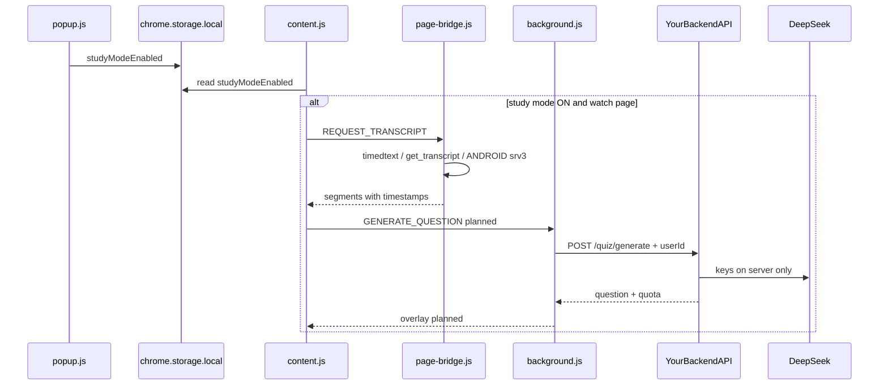

# Архитектура YouTube Quize-Mode

## Обзор



## Слои расширения

### popup.js / popup.html

- Toggle **«Режим учёбы»** → ключ `studyModeEnabled` в `chrome.storage.local`.
- Планируется: счётчик квоты, ссылка Premium.

### content.js

- Срабатывает на `https://www.youtube.com/watch?v=*`.
- При включённом study mode вызывает `fetchTranscript(videoId)`.
- Слушает `chrome.storage.onChanged` и `yt-navigate-finish` (SPA).
- Логирует user ID через `GET_GOOGLE_USER_ID` (background).
- Планируется: пауза плеера, оверлей quiz, отправка чанков в background.

### transcript.js

- Оркестрация загрузки транскрипта через `page-bridge.js`.
- `selectCaptionTrack`: ручные субтитры → ASR, язык аудио видео.
- Парсеры: JSON3, XML (`<text>`), srv3 (`<p t d><s>`).
- Парсер InnerTube `get_transcript` (engagement panel segments).

### page-bridge.js (page context)

Inject через `web_accessible_resources`. Не имеет доступа к `chrome.*`.

**Источники субтитров (по приоритету):**

1. Кеш перехваченного UI-запроса `get_transcript` (fetch interceptor).
2. `get_transcript` с params из: `next` → `ytInitialData` → player → protobuf.
3. Timedtext (пропуск raw/json/xml при `exp=xpe`).
4. ANDROID `/player` + timedtext `fmt=srv3`.

### background.js

- `chrome.identity.getProfileUserInfo` → Google user ID.
- Fallback: `anonymousUserId` (UUID в storage).
- Message: `GET_GOOGLE_USER_ID`.
- Планируется: `api-client.js`, session bootstrap, `GENERATE_QUESTION`, quota.

## chrome.storage.local

| Ключ | Тип | Описание |
|------|-----|----------|
| `studyModeEnabled` | boolean | Режим учёбы (default `false`) |
| `anonymousUserId` | string | UUID если нет Google profile ID |
| `sessionToken` | string | 🔜 после интеграции backend |
| `quotaCache` | object | 🔜 `{ used, limit, resetsAt }` для UI |

**Не хранить:** DeepSeek/OpenAI/Gemini/Helicone API keys.

### Backend `.env` (LLM)

| Переменная | Описание |
|------------|----------|
| `LLM_PROVIDER` | `deepseek` (default), `openai`, `gemini` |
| `LLM_MODEL` | `deepseek-chat` для quiz-генерации |
| `DEEPSEEK_API_KEY` | Ключ с platform.deepseek.com |
| `DEEPSEEK_BASE_URL` | `https://api.deepseek.com` |

## Message passing (текущее и план)

| type | Направление | Статус |
|------|-------------|--------|
| `GET_GOOGLE_USER_ID` | content → background | ✅ |
| `REQUEST_PLAYER_DATA` | content → page (postMessage) | ✅ internal |
| `REQUEST_TRANSCRIPT` | content → page (postMessage) | ✅ internal |
| `GET_LLM_STATUS` | popup → background | 🔜 |
| `GENERATE_QUESTION` | content → background | 🔜 |
| `GET_QUOTA` | popup → background | 🔜 |

## Backend API (план)

Ключи — только в `.env` на сервере ([`.env.example`](../.env.example)).

### POST /v1/auth/bootstrap

```json
{ "userId": "...", "userSource": "google" | "anonymous" }
→ { "sessionToken": "...", "expiresAt": "..." }
```

### POST /v1/quiz/generate

```json
{
  "videoId": "zwSikeU-STI",
  "transcriptChunk": [{ "startMs": 0, "text": "..." }],
  "language": "ru"
}
→ {
  "status": "success" | "skip",
  "pauseTimestampMs": 342000,
  "question": "...",
  "options": ["...", "...", "...", "..."],
  "correctIndex": 1,
  "quota": { "used": 3, "limit": 5 }
}
```

Лимиты и Premium проверяются **на сервере**; extension только отображает `quota`.

## Формат сегмента транскрипта

```javascript
{
  startMs: number,
  durationMs: number,
  text: string
}
```

Утилита `formatTimestamp(ms)` → `"MM:SS"` для LLM-промпта.

## Безопасность

- Секреты LLM — только backend `.env`, в git не коммитить.
- `page-bridge.js` изолирован от extension APIs; общение через `postMessage` (`source: quize-mode-extension`).
- Content script не получает API keys и session internals — только результаты через background.

## Известные ограничения YouTube

- Timedtext с `exp=xpe` требует PoToken — обход через ANDROID srv3 или UI cache.
- `get_transcript` из extension часто возвращает 400; fallback srv3 работает.
- SPA: смена видео без reload — обработка через `yt-navigate-finish`.
